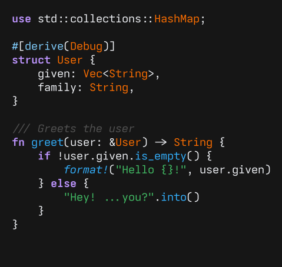
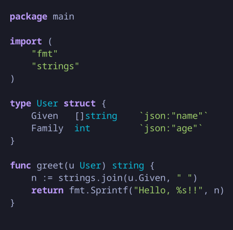
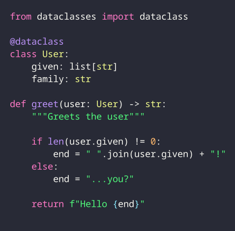

# leafpress

A small library and command-line utility for rendering highlighted source code as Scalable Vector Graphics (SVG).

Built in Rust using [Tree-sitter](https://tree-sitter.github.io) for parsing, and [Pango](https://www.gtk.org/docs/architecture/pango) and [Cairo](https://www.cairographics.org/) for text rendering.

<p>
  
  
  
</p>

> [!WARNING]
> Leafpress is currently **unstable and a work in progress**. APIs and behaviour may change without notice.


<!-- mtoc-start -->

* [Features](#features)
* [Installation](#installation)
  * [From crates](#from-crates)
  * [From source](#from-source)
    * [Library](#library)
    * [Command-line utility](#command-line-utility)
* [Usage](#usage)
  * [Using a compile-time parser](#using-a-compile-time-parser)
  * [Using a runtime parser](#using-a-runtime-parser)
  * [Command-line utility](#command-line-utility-1)

<!-- mtoc-end -->

## Features
* [x] Portable SVG output. Unicode text is rendered as paths without font dependencies.
* [x] Compile-time parser integration.
* [x] Runtime parser integration (dynamic shared library and scheme files).
* [x] Large collection of built-in Base16 colour schemes sourced from [tinted-theming](https://github.com/tinted-theming).
* [x] Custom user-defined themes.
* [x] Custom user-defined highlight maps.
* [x] Text decorations (**bold**, _italic_, <u>underline</u>, <u>undercurl</u>, ~~strikethrough~~).
* [x] Supports font ligatures.
* [ ] User-defined kerning and line spacing.
* [ ] User-defined image height and width
* [ ] Language injection
* [ ] More and better tests
* [ ] A better to do list

## Installation
### From crates
**TBD**

### From source

Clone this repository and run the following commands.

#### Library
```sh
cargo build --release -p leafpress
```

#### Command-line utility
Leafpress cannot compile tree-sitter grammars. It is recommended that you also install [tree-sitter-cli](https://github.com/tree-sitter/tree-sitter/tree/master/crates/cli) and its associated dependencies (incl. C compiler and JavaScript runtime).

```sh
cargo build --release -p leafpress-cli
cargo install --path crate/leafpress-cli
```

## Usage
Leafpress supports both compile-time and runtime parser loading. Compile-time loading is more convenient when the required grammar is known at build time. Runtime loading allows grammars and highlight queries to be selected dynamically, making it better suited to generic Tree-sitter tooling.

### Using a compile-time parser
```rust
use std::path::Path;
use leafpress::{generate_svg, render::Format, theme};

fn main() -> Result<(), Box<dyn std::error::Error>> {
    let output_path = Path::new("./output.svg");
    let source = br#"package main

import "fmt"

func main() {
    fmt.Println("Hello, world!")
}
"#;

    let language = tree_sitter_go::LANGUAGE.into();
    let query = tree_sitter::Query::new(&language, tree_sitter_go::HIGHLIGHTS_QUERY)?;

    let palette = theme::GITHUB_DARK;
    let format = Format::default();

    generate_svg(
        output_path,
        source,
        &language,
        &query,
        &palette,
        &format,
        None,
    )?;

    Ok(())
}
```

### Using a runtime parser
```rust
use std::path::Path;
use leafpress::{generate_svg, parser, render::Format, theme};

fn main() -> Result<(), Box<dyn std::error::Error>> {
    let output_path = Path::new("./output.svg");
    let source = br#"package main

import "fmt"

func main() {
    fmt.Println("Hello, world!")
}
"#;

    let loaded = parser::load_dynamic("./go.so")?;
    let query = parser::load_query("./highlights.scm", &loaded.language)?;

    let palette = theme::GITHUB_DARK;
    let format = Format::default();

    generate_svg(
        output_path,
        source,
        &loaded.language,
        &query,
        &palette,
        &format,
        None,
    )?;

    Ok(())
}
```

### Command-line utility

Render a source file to SVG:

```sh
leafpress render main.go --lang go
````

The output is written to `./output.svg` by default. Use `-o` to specify a different path:

```sh
leafpress render main.go --lang go -o main.svg
```

Formatting can be optionally customised with --theme, --font, --size, and --padding:

```sh
leafpress render main.go \
    --lang go \
    --theme "Github Dark"
    --font "Iosevka Term" \
    --size 14 \
    --padding 20
```

List available themes:

```sh
leafpress list-themes
```

List available Tree-sitter grammars:

```sh
leafpress list-grammars
```

Both listing commands support JSON output with `--json`.

By default, grammars are located using the Tree-sitter configuration file. Use `--grammar-dir` to specify a parser directory directly:

```sh
leafpress render main.go --lang go --grammar-dir ~/src/tree-sitter-grammars
```

The grammar directory and Tree-sitter configuration path can also be set with `TREESITTER_GRAMMAR_DIR` and `TREESITTER_CONFIG_PATH`, respectively. 
